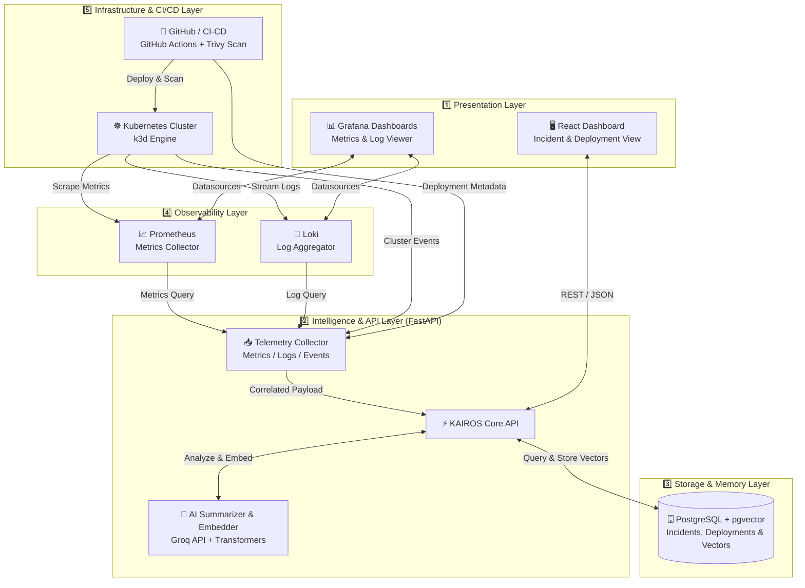

# ⚡ KAIROS: Incident Intelligence Platform

<div align="center">


**Transform Production Incidents into Organizational Knowledge with AI-Powered Telemetry Correlation & Similarity Search**

[](https://github.com/features/actions)
[](https://k3d.io/)
[](https://www.docker.com/)
[](https://fastapi.tiangolo.com/)
[](https://react.dev/)
[](https://github.com/pgvector/pgvector)
[](https://groq.com/)
[](https://github.com/aquasecurity/trivy)
[](https://opensource.org/licenses/MIT)

---

[Explore Features](#-core-features) • [System Architecture](#%EF%B8%8F-system-architecture) • [Getting Started](#-quick-start) • [Documentation](#-documentation) • [Roadmap](#-roadmap)

</div>

---

## 🌟 What is KAIROS?

In Greek mythology, **Kairos (καιρός)** represents the *opportune moment*—the exact right time for decisive action. 

In modern cloud-native DevOps, when a production deployment fails or an infrastructure incident strikes, every second counts. **KAIROS** captures that critical moment, automatically aggregating telemetry across isolated tools, correlating logs and metrics, synthesizing root-cause summaries using AI, and preserving the resolution in a vector-powered engineering memory bank so **your team never solves the same problem twice.**

> *"When a deployment breaks, engineers shouldn't waste hours manually jumping between Grafana, Prometheus, Loki, Kubernetes CLI, and GitHub. KAIROS unifies your entire observability context into one coherent narrative."*

---

## 🚨 The Problem vs. 💡 The KAIROS Solution

| ❌ Traditional Incident Response (Manual & Siloed) | ✅ The KAIROS Way (Automated & Intelligent) |
| :--- | :--- |
| **Information Silos:** Engineers open 5+ browser tabs (Grafana, Loki, GitHub Actions, K8s dashboard) to piece together clues. | **Unified Evidence Gathering:** Automatically collects metrics, logs, deployment changes, and cluster events into a single timeline. |
| **Context Switching:** Mentally correlating high CPU alerts at 14:02 with a pod restart at 14:03 and a git commit at 14:00. | **Automated Correlation:** Links code deployments directly to application failures and infrastructure degradation. |
| **Tribal Knowledge & Memory Loss:** When the senior SRE who solved an issue leaves the company, the knowledge leaves with them. | **Vector Memory Bank (pgvector):** Embeds incident signatures into PostgreSQL. When a new bug appears, KAIROS instantly recommends past resolutions. |
| **Slow MTTR (Mean Time To Resolution):** Average investigation takes 30 to 110 minutes of trial and error. | **AI Root-Cause Analysis:** Groq LLM digests complex stack traces and metrics to provide instant, plain-English summaries and action items. |

---

## 🔄 The Five-Stage Intelligence Workflow

Everything KAIROS builds fits seamlessly into five core operational stages:

```
     ┌───────────┐
  ┌─▶│  COLLECT  │  📡 Gather logs, metrics, events, and deployment proof from DevOps tools
  │  └─────┬─────┘
  │        ▼
  │  ┌───────────┐
  │  │ CORRELATE │  🔗 Connect isolated data points into a unified incident timeline
  │  └─────┬─────┘
  │        ▼
  │  ┌───────────┐
  │  │  ANALYZE  │  🧠 Groq LLM synthesizes root-cause summaries & remediation steps
  │  └─────┬─────┘
  │        ▼
  │  ┌───────────┐
  │  │ REMEMBER  │  💾 Generate vector embeddings and store in PostgreSQL (pgvector)
  │  └─────┬─────┘
  │        ▼
  │  ┌───────────┐
  │  │ RETRIEVE  │  🔍 Instantly match new anomalies against historical incident resolutions
  └──└───────────┘
```

---

## ✨ Core Features

<table>
  <thead>
    <tr>
      <th>Feature Category</th>
      <th>Capabilities</th>
      <th>Technology Used</th>
    </tr>
  </thead>
  <tbody>
    <tr>
      <td><b>🔄 CI/CD & Pipeline</b></td>
      <td>Automated builds, test execution, container packaging, and seamless deployment workflows.</td>
      <td><code>GitHub Actions</code>, <code>Docker</code></td>
    </tr>
    <tr>
      <td><b>🛡️ Container Security</b></td>
      <td>Continuous container vulnerability scanning integrated directly into the CI/CD pipeline before cluster deployment.</td>
      <td><code>Trivy Scanner</code></td>
    </tr>
    <tr>
      <td><b>☸️ Orchestration</b></td>
      <td>Lightweight, fast, local multi-node Kubernetes cluster management for reproducible staging and prod simulation.</td>
      <td><code>k3d</code>, <code>Kubernetes</code>, <code>Helm</code></td>
    </tr>
    <tr>
      <td><b>📈 Observability Stack</b></td>
      <td>Real-time system metrics scraping, alert evaluation, and centralized high-throughput log aggregation.</td>
      <td><code>Prometheus</code>, <code>Grafana</code>, <code>Loki</code></td>
    </tr>
    <tr>
      <td><b>🤖 AI Root-Cause Engine</b></td>
      <td>Ultra-fast LLM inference that analyzes stack traces and Prometheus metrics to explain *why* something broke.</td>
      <td><code>Groq API</code> (Llama 3), <code>FastAPI</code></td>
    </tr>
    <tr>
      <td><b>🧠 Similarity Search</b></td>
      <td>Semantic similarity search over historical incidents using high-dimensional embeddings to find past fixes.</td>
      <td><code>sentence-transformers</code>, <code>pgvector</code></td>
    </tr>
    <tr>
      <td><b>🖥️ Interactive Dashboard</b></td>
      <td>Sleek, responsive UI for monitoring deployments, viewing active alerts, and exploring AI-generated incident reports.</td>
      <td><code>React.js</code>, <code>Tailwind CSS</code></td>
    </tr>
  </tbody>
</table>

---

## 🏗️ System Architecture

KAIROS is engineered as a clean, multi-layered cloud-native platform:



---

## 🛠️ Technology Matrix

| Layer | Technology | Role & Responsibility |
| :--- | :--- | :--- |
| **Version Control & CI/CD** | Git, GitHub Actions | Automated linting, testing, Docker builds, and security gates. |
| **Container & Runtime** | Docker, Trivy | Image packaging and static vulnerability detection. |
| **Orchestration** | Kubernetes (`k3d`), Helm | Container management, self-healing, service discovery, and routing. |
| **Metrics & Monitoring** | Prometheus | Time-series data scraping (CPU, Memory, Network, Latency). |
| **Log Aggregation** | Grafana Loki | Centralized, label-based log querying and stack-trace capture. |
| **Backend API** | Python 3.11+, FastAPI | High-performance async REST API, telemetry correlation, and business logic. |
| **AI & LLM** | Groq API, HuggingFace | Sub-second incident summarization and embedding generation. |
| **Database & Vectors** | PostgreSQL, `pgvector` | Relational storage and vector similarity index for historical incident matching. |
| **Frontend UI** | React, Vite | Modern, responsive dashboard for engineering teams. |

---

## 🚀 Quick Start

Get the entire KAIROS platform running on your local machine in minutes.

### 📋 Prerequisites
Ensure you have the following installed on your system:
- [Docker & Docker Compose](https://www.docker.com/)
- [k3d](https://k3d.io/) (for local Kubernetes cluster)
- [kubectl](https://kubernetes.io/docs/tasks/tools/)
- [Git](https://git-scm.com/)

### ⚡ 1-Minute Local Setup

```bash
# 1. Clone the repository
git clone https://github.com/yourusername/kairos.git
cd kairos

# 2. Configure environment variables
cp .env.example .env
# Optional: Add your GROQ_API_KEY inside .env for AI summarization features

# 3. Create the local Kubernetes cluster
k3d cluster create kairos-cluster --api-port 6550 -p "8080:80@loadbalancer"

# 4. Launch backend, database, observability stack, and dashboard via Docker Compose
docker-compose up -d --build

# 5. Verify deployment status
docker-compose ps
```

### 🌐 Accessing the Services

Once deployed, access the respective portals via your browser:

| Service | Local URL | Description |
| :--- | :--- | :--- |
| **KAIROS Dashboard** | `http://localhost:3000` | Main interactive web interface for incident management |
| **FastAPI Swagger Docs** | `http://localhost:8000/docs` | Interactive OpenAPI documentation and API tester |
| **Grafana Portal** | `http://localhost:3001` | System metrics, custom charts, and Loki log explorer |
| **Prometheus UI** | `http://localhost:9090` | Raw metric targets, PromQL query builder |

---

## 📁 Project Structure

<details>
<summary><b>Click to expand the comprehensive workspace directory tree</b></summary>

```text
kairos/
├── 📄 README.md                # Project documentation (You are here!)
├── 📄 docker-compose.yml       # Local multi-service orchestration
├── 📄 .env.example             # Environment variable template
├── 📁 app/                     # Backend API & Intelligence Engine (FastAPI)
│   ├── 📁 api/                 # REST endpoints (incidents, deployments, search, health)
│   ├── 📁 services/            # Core integration logic (GitHub, K8s, Prometheus, Loki)
│   ├── 📁 ai/                  # Groq LLM summarizer, embedding generator & prompt templates
│   ├── 📁 database/            # SQLAlchemy models, CRUD operations & migrations
│   └── 📁 utils/               # Configuration loading & custom logging
├── 📁 frontend/                # SPA Dashboard (React)
│   ├── 📁 src/                 # Components, Pages, State management & API clients
│   └── 📄 package.json         # Frontend dependencies & build scripts
├── 📁 deployment/              # Infrastructure & CI/CD manifests
│   ├── 📁 docker/              # Dockerfiles & container optimization configs
│   ├── 📁 kubernetes/          # K8s Deployments, Services, ConfigMaps & Secrets
│   └── 📁 github-actions/      # CI/CD pipeline definitions (`ci-cd.yaml`)
├── 📁 monitoring/              # Observability stack configurations
│   ├── 📁 prometheus/          # Scrape configs & alerting rules (`prometheus.yml`)
│   ├── 📁 grafana/             # Auto-provisioned datasources & dashboards
│   └── 📁 loki/                # Log storage & chunking rules (`loki-config.yml`)
├── 📁 sample-apps/             # Test targets for generating telemetry
│   ├── 📁 healthy-app/         # Baseline functioning microservice
│   └── 📁 broken-app/          # Intentionally buggy app for incident simulation
├── 📁 sample-incidents/        # Pre-packaged disaster scenarios (OOM, CrashLoop, Timeout)
├── 📁 docs/                    # Architectural deep-dives & project specifications
└── 📁 scripts/                 # Automated bootstrap & cluster cleanup utilities
```

</details>

---

## 🎯 Verification & Success Criteria

When testing or deploying KAIROS, verify the platform passes the following end-to-end operational checklist:

- [x] **CI/CD Build Automation:** GitHub Actions workflow successfully lints, builds, and pushes Docker images.
- [x] **Vulnerability Scanning:** Trivy evaluates container layers without reporting blocking critical CVEs.
- [x] **Cluster Orchestration:** k3d cluster initializes with healthy pods across all service tiers.
- [x] **Telemetry Collection:** Prometheus actively scrapes pod metrics; Loki receives real-time container stdout/stderr logs.
- [x] **Automated Incident Capture:** Simulated pod crashes (e.g., `OOMKilled` or `CrashLoopBackOff`) automatically generate an incident record.
- [x] **AI Summarization:** Groq LLM evaluates the failure trace and populates the root cause summary within seconds.
- [x] **Vector Similarity Retrieval:** `pgvector` accurately matches synthetic duplicate incidents with similarity scores $> 85\%$.
- [x] **UI Rendering:** React dashboard renders real-time timeline updates without manual page refreshes.

---

## 🔒 Security Best Practices

- **Zero Hardcoded Secrets:** All API keys, database credentials, and webhook tokens are injected strictly via `.env` files or Kubernetes Secrets.
- **Pipeline Gatekeeping:** Integrated Trivy container scanning ensures vulnerable base images are flagged before production deployment.
- **Least Privilege Access:** Kubernetes ServiceAccounts and Role-Based Access Control (RBAC) limit telemetry scraping strictly to required namespaces.

---

## 🤝 Contributing

We welcome contributions from developers, DevOps engineers, and SREs! 

1. Fork the repository
2. Create your feature branch (`git checkout -b feature/amazing-feature`)
3. Commit your changes (`git commit -m 'feat: add amazing feature'`)
4. Push to the branch (`git push origin feature/amazing-feature`)
5. Open a Pull Request

---

## 📄 License

This project is licensed under the **MIT License** — see the [LICENSE](LICENSE) file for details.

---

<div align="center">
  <p>Built with ❤️ for modern SRE & DevOps teams.</p>
  <p><b>KAIROS</b> — <i>Never solve the same incident twice.</i></p>
</div>