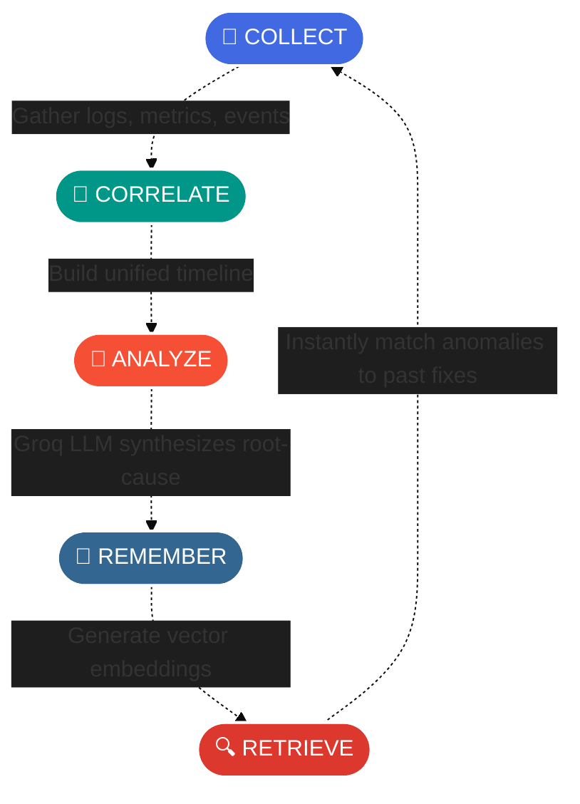
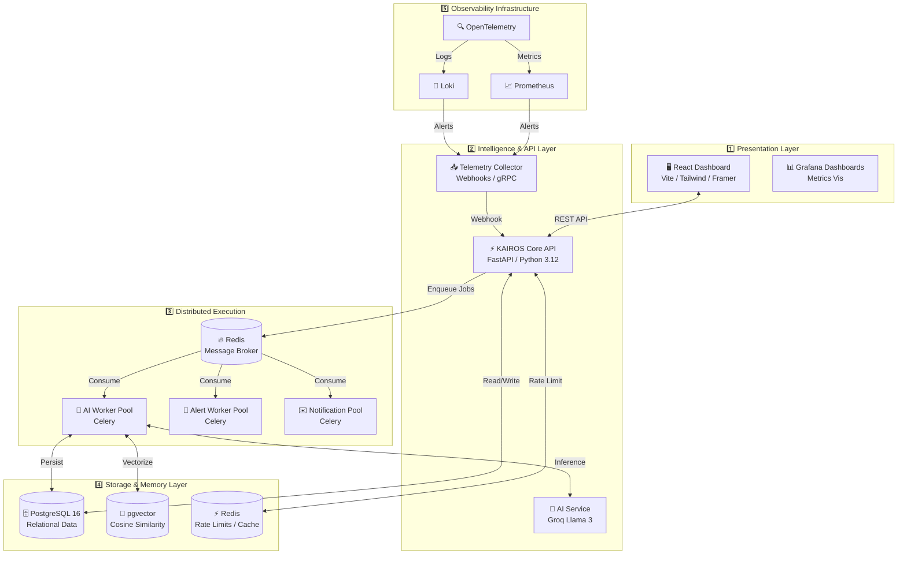

<div align="center">
  

  <h3>🧠 Intelligent Incident Response | 📊 AI-Driven Telemetry | ⚡ Distributed Execution</h3>

  <p align="center">
    <a href="https://github.com/bhargavatejagolla"></a>
    <a href="https://github.com/bhargavatejagolla/Kairos/actions/workflows/ci.yml"></a>
    <a href="#"></a>
    <a href="#"></a>
    <br/>
    <a href="https://fastapi.tiangolo.com/"></a>
    <a href="https://reactjs.org/"></a>
    <a href="https://www.postgresql.org/"></a>
    <a href="https://redis.io/"></a>
    <br/>
    <a href="https://opentelemetry.io/"></a>
    <a href="https://kustomize.io/"></a>
    <a href="LICENSE"></a>
  </p>

  <p align="center">
    <a href="https://readme-typing-svg.herokuapp.com"></a>
  </p>
</div>

---

<details open>
<summary><b>📚 Table of Contents</b></summary>

- [🌟 The Problem: Swivel-Chair DevOps](#-the-problem-swivel-chair-devops)
- [💡 The Solution: Autonomous AI SRE](#-the-solution-autonomous-ai-sre)
- [🎯 Core Use Cases](#-core-use-cases)
- [⚙️ How It Works (Event-Driven Architecture)](#️-how-it-works-event-driven-architecture)
- [🛠️ Deep Dive: The Technology Stack](#️-deep-dive-the-technology-stack)
- [🏗️ Complete Enterprise Architecture](#-complete-enterprise-architecture)
- [🚀 Detailed Installation & Quick Start](#-detailed-installation--quick-start)
- [🌐 Accessing the Services](#-accessing-the-services)
- [🤝 Authors & Contributors](#-authors--contributors)

</details>

---

## 🌟 The Problem: Swivel-Chair DevOps

In modern enterprise environments (Site Reliability Engineering & DevOps), debugging production failures is a chaotic, fragmented nightmare. When an outage occurs, engineers are forced to play detective across disconnected, noisy tools:

<div align="center">
  <table>
    <tr>
      <td align="center"><br/><b>Grafana</b><br/>Searching for CPU/Memory spikes</td>
      <td align="center"><br/><b>Loki / ELK</b><br/>Scouring for error traces</td>
      <td align="center"><br/><b>Kubernetes</b><br/>Checking for CrashLoopBackOff</td>
      <td align="center"><br/><b>GitHub CI/CD</b><br/>Checking who broke the build</td>
    </tr>
  </table>
</div>

This **"Swivel-Chair DevOps"** wastes precious time. Furthermore, when the incident is finally resolved, the knowledge of *how* it was fixed lives only in a senior engineer's head or gets buried in an unread Slack channel. **The next time the exact same error happens, the team wastes another 3 hours solving it all over again.**

<br/>

## 💡 The Solution: Autonomous AI SRE

**KAIROS** acts as a centralized, autonomous **AI SRE**. 

It connects directly to your infrastructure, reads your logs and metrics in real-time, correlates them using Advanced LLMs (**Groq / Llama 3**), and generates plain-English root-cause analyses. 

Crucially, it commits every solved incident to a **Vector Database (pgvector)**, giving your organization a permanent, queryable "long-term memory" of how to fix production bugs.

<br/>

---

## 🎯 Core Use Cases

KAIROS radically transforms how engineering teams operate, shifting them from a reactive panic state to a proactive, automated mindset:

| ⚡ Use Case | ❌ Before KAIROS | ✅ After KAIROS |
| :--- | :--- | :--- |
| **🚨 Outage Triage** | Panic. 5 engineers on a Zoom call frantically checking different dashboards. | KAIROS automatically ingests the failing logs, correlates them with a recent code deployment, and tells you exactly what broke. |
| **📝 Root Cause Analysis (RCA)** | Writing RCAs takes days. Details are forgotten, and documents are sloppy. | KAIROS automatically generates a blameless, detailed Markdown RCA document the second the incident is resolved. |
| **🧠 Organizational Memory** | Junior engineers get stuck on bugs that senior engineers solved months ago. | When a junior engineer pastes an error trace, KAIROS performs a Vector Similarity Search and says: *"This is a Redis Timeout. John solved this 3 months ago by increasing the connection pool. Here is the playbook."* |
| **🔇 Alert Fatigue** | Slack is flooded with meaningless Prometheus CPU alerts that everyone ignores. | Alerts are intercepted by the KAIROS Background Workers, evaluated by AI, and only escalated to humans if they actually impact user experience. |

<br/>

---

## ⚙️ How It Works (Event-Driven Architecture)

KAIROS executes complex workflows through a decoupled, asynchronous pipeline designed for high throughput:

1. **Collect (Telemetry):** The platform continuously listens to your OpenTelemetry streams, Prometheus metrics, and Kubernetes events.
2. **Correlate (Context Window):** When an anomaly occurs, KAIROS bundles the raw JSON logs, the time-series metrics, and recent CI/CD deployments into a massive context window.
3. **Analyze (LLM Inference):** This context is sent to the ultra-fast Groq API (running Llama 3). The AI reasons over the data and extracts the exact root cause, filtering out the noise.
4. **Remember (Vectorization):** Once the incident is marked "Resolved", KAIROS converts the incident narrative into high-dimensional vector embeddings using HuggingFace embeddings.
5. **Retrieve (Semantic Search):** These embeddings are stored in PostgreSQL via `pgvector`. Future incidents are instantly matched against this database using cosine similarity.

<div align="center">



</div>

<br/>

---

## 🛠️ Deep Dive: The Technology Stack

We didn't just build an app; we built an **enterprise-grade distributed platform**. Here is exactly what tools we chose and *why*:

### 1. 🧠 The Intelligence Layer (Backend API)
* **Python 3.12 & FastAPI**: Chosen over Node/Go because Python is the undisputed king of AI/ML integration. FastAPI provides blazingly fast asynchronous routing, Pydantic data validation, and auto-generated OpenAPI docs.
* **Clean Architecture**: The codebase is strictly decoupled into Routers, Services, Repositories, and Core domains. You can swap out the database or AI provider without rewriting the business logic.
* **Security & Auth**: Built-in Role-Based Access Control (RBAC), multi-tenancy support, JWT token validation, and OWASP-compliant middleware.

### 2. ⚡ The Execution Layer (Background Jobs)
* **Celery & Redis Broker**: AI API calls (like sending a massive log chunk to an LLM) take time. If we did this on the main FastAPI thread, the server would lock up. We use Celery and Redis to push heavy AI reasoning and email notifications into asynchronous background queues, ensuring 100% API responsiveness.

### 3. 🗄️ The Memory Layer (Databases)
* **PostgreSQL 16**: The world's most robust relational database. Used for storing Users, RBAC Policies, Organizations, and Projects.
* **pgvector**: Instead of paying for expensive external vector databases (like Pinecone), we installed the `pgvector` extension directly into Postgres. This allows us to perform mathematical similarity searches (Cosine Distance) on historical incidents right alongside our relational data.
* **Redis Cache**: Used for lightning-fast rate limiting (preventing DDoS attacks) and caching heavy API responses via `FastAPICache`.

### 4. 🖥️ The Presentation Layer (Frontend)
* **React 19 & Vite**: React provides a component-driven UI. Vite ensures millisecond build times. 
* **TailwindCSS v4**: Allows us to build a gorgeous, dark-mode-first, fully responsive enterprise dashboard.
* **Framer Motion**: Adds butter-smooth micro-animations that make the platform feel premium and alive.
* **TanStack Query & Zustand**: State management handles robust server-state caching and instantaneous global state mutations without prop-drilling.

### 5. 🚢 The Infrastructure & CI/CD Layer
* **Kubernetes (k3d / Kustomize)**: The entire stack is containerized and managed by Kubernetes. We use Kustomize to manage environment-specific configurations (`base`, `local`, `production`) without the complexity of Helm charts.
* **Horizontal Pod Autoscaling (HPA)**: The system automatically spins up clone API pods if CPU usage spikes past 70%.
* **GitHub Actions**: Fully automated pipelines that run 95+ pytest unit/integration tests, build immutable Docker images, and push them to the GitHub Container Registry (GHCR) on every single commit.

<br/>

---

## 🏗️ Complete Enterprise Architecture

<div align="center">
  
</div>



<br/>

---

## 🚀 Detailed Installation & Quick Start

Get the entire **KAIROS** platform running on your local machine in minutes. 

### 📋 Prerequisites
- **Docker Engine & Docker Compose** (Make sure the daemon is running)
- **Kubernetes** (`k3d`, `minikube`, or `kind`)
- **Python 3.12+ & Node.js 20+**
- **Make** (Build automation tool)

### ⚡ Option 1: Docker Compose (For Rapid Development)

If you are a developer looking to write code and test quickly without Kubernetes overhead:

```bash
# 1. Clone the repository
git clone https://github.com/bhargavatejagolla/kairos.git
cd kairos

# 2. Configure environment variables
cp backend/.env.example backend/.env
# Open backend/.env and inject your GROQ_API_KEY to enable AI capabilities.

# 3. Launch the entire microservice platform in detached mode
docker-compose up -d --build

# 4. View logs to ensure Celery and FastAPI started correctly
docker-compose logs -f backend celery_worker
```

### ☸️ Option 2: Kubernetes (For Production/Enterprise Deployment)

If you want to simulate or deploy to a real cloud-native cluster with Autoscaling (HPA) and Ingress controllers:

```bash
# 1. Create a local k3d Kubernetes cluster with Ingress ports mapped to your localhost
make k3d-create

# 2. Deploy all Kustomize manifests (DB, Redis, Backend, Frontend, Ingress, HPA)
make deploy-local

# 3. Watch the pods spin up (Wait for them to reach 'Running' state)
kubectl get pods -n kairos -w

# 4. Check the Horizontal Pod Autoscaler status
kubectl get hpa -n kairos

# 5. (Optional) Run the disaster recovery / backup scripts
./k8s/scripts/backup_postgres.sh
```
> [!NOTE]
> For detailed operational debugging and production commands, refer to the [Production Runbook (docs/RUNBOOK.md)](docs/RUNBOOK.md).

<br/>

---

## 🌐 Accessing the Services

Once successfully deployed (via Compose or Kubernetes), access the respective portals via your browser:

| Service | URL | Description |
| :--- | :--- | :--- |
| **KAIROS React Dashboard** | `http://app.kairos.local` | Main interactive web interface for incident management |
| **FastAPI Swagger UI** | `http://api.kairos.local/docs` | Interactive OpenAPI documentation and API tester |
| **Flower (Celery Monitor)** | `http://localhost:5555` | GUI for monitoring async background jobs and worker health |

*(Note: If using Kubernetes locally, you must add `127.0.0.1 app.kairos.local api.kairos.local` to your machine's `/etc/hosts` or `C:\Windows\System32\drivers\etc\hosts` file to resolve the Ingress domain names).*

<br/>

---

## 🤝 Authors & Contributors

<div align="center">
  <a href="https://github.com/bhargavatejagolla">
    
  </a>
</div>

<br/>

We welcome contributions from developers, DevOps engineers, and SREs! 
1. **Fork** the repository
2. **Create** your feature branch (`git checkout -b feature/amazing-feature`)
3. **Commit** your changes (`git commit -m 'feat: add amazing feature'`)
4. **Push** to the branch (`git push origin feature/amazing-feature`)
5. **Open** a Pull Request against the `main` branch.

<br/>

## 📄 License

This project is licensed under the **MIT License** — see the [LICENSE](LICENSE) file for details.

---

<div align="center">
  
</div>
