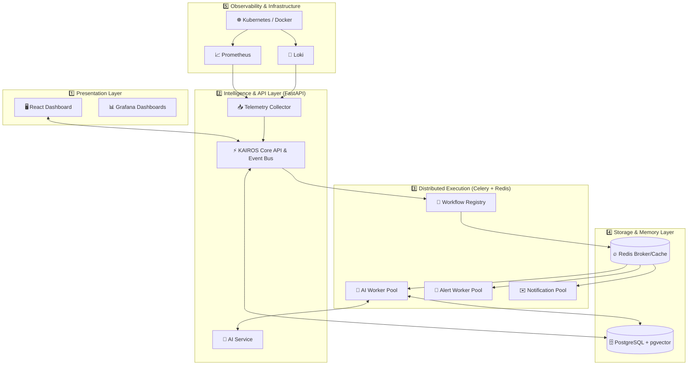

<div align="center">

# ⚡ KAIROS: Enterprise AI Site Reliability Engineer Platform


[](https://github.com/bhargavatejagolla)
[](#)
[](https://fastapi.tiangolo.com/)
[](https://react.dev/)
[](https://www.docker.com/)

**Transform Production Incidents into Organizational Knowledge with AI-Powered Telemetry Correlation, Vector Similarity Search, and a Robust Distributed Processing Engine.**

[Explore Features](#-core-features) • [System Architecture](#%EF%B8%8F-system-architecture) • [Getting Started](#-quick-start) • [Documentation](#-documentation)

<br/>

</div>

---

## 🌟 What is KAIROS?

In Greek mythology, **Kairos (καιρός)** represents the *opportune moment*—the exact right time for decisive action. 

In modern cloud-native DevOps, when a production deployment fails or an infrastructure incident strikes, every second counts. **KAIROS** acts as an **Enterprise AI Site Reliability Engineer**, automatically aggregating telemetry across isolated tools, correlating logs and metrics, synthesizing root-cause summaries using LLMs, and executing asynchronous remediation workflows. 

Designed and engineered by **Golla Bhargava Teja**, KAIROS ensures **your team never solves the same problem twice.**

> *"When a deployment breaks, engineers shouldn't waste hours manually jumping between Grafana, Prometheus, Loki, Kubernetes CLI, and GitHub. KAIROS unifies your entire observability context into one coherent narrative."*

---

## 🚀 The AI Enterprise Advantage

| ❌ Traditional Incident Response (Manual & Siloed) | ✅ The KAIROS Way (Automated & Intelligent) |
| :--- | :--- |
| **Information Silos:** Engineers open 5+ browser tabs (Grafana, Loki, GitHub Actions, K8s dashboard) to piece together clues. | **Unified Evidence Gathering:** Automatically collects metrics, logs, deployment changes, and cluster events into a single timeline. |
| **Context Switching:** Mentally correlating high CPU alerts at 14:02 with a pod restart at 14:03 and a git commit at 14:00. | **Automated Correlation:** Links code deployments directly to application failures and infrastructure degradation. |
| **Tribal Knowledge & Memory Loss:** When the senior SRE who solved an issue leaves the company, the knowledge leaves with them. | **Vector Memory Bank (pgvector):** Embeds incident signatures into PostgreSQL. When a new bug appears, KAIROS instantly recommends past resolutions. |
| **Monolithic Bottlenecks:** Direct API calls blocking threads waiting on 3rd-party services. | **Distributed Background Engine:** Idempotent, robust workflow engine built on Celery, Redis, and event buses ensuring 0% data loss. |
| **Slow MTTR (Mean Time To Resolution):** Average investigation takes 30 to 110 minutes of trial and error. | **AI Root-Cause Analysis:** Groq LLM digests complex stack traces and metrics to provide instant, plain-English summaries and action items. |

---

## 🔄 The Enterprise Intelligence Workflow

KAIROS executes complex workflows through a decoupled, Event-Driven Architecture:

```text
     ┌───────────┐
  ┌─▶│  COLLECT  │  📡 Gather logs, metrics, events, and deployment proof from DevOps tools
  │  └─────┬─────┘
  │        ▼
  │  ┌───────────┐
  │  │ CORRELATE │  🔗 Connect isolated data points into a unified incident timeline
  │  └─────┬─────┘
  │        ▼
  │  ┌───────────┐
  │  │  ANALYZE  │  🧠 Groq LLM synthesizes root-cause summaries via Distributed Background Jobs
  │  └─────┬─────┘
  │        ▼
  │  ┌───────────┐
  │  │ REMEMBER  │  💾 Generate vector embeddings and store in PostgreSQL (pgvector)
  │  └─────┬─────┘
  │        ▼
  │  ┌───────────┐
  │  │ RETRIEVE  │  🔍 Instantly match new anomalies against historical incident resolutions
  └──└───────────┘
```

---

## ✨ Core Features

<table>
  <thead>
    <tr>
      <th>Feature Category</th>
      <th>Capabilities</th>
      <th>Technology Used</th>
    </tr>
  </thead>
  <tbody>
    <tr>
      <td><b>🔄 CI/CD & Pipeline</b></td>
      <td>Automated builds, test execution, container packaging, and seamless deployment workflows.</td>
      <td><code>GitHub Actions</code>, <code>Docker</code></td>
    </tr>
    <tr>
      <td><b>🛡️ Security & RBAC</b></td>
      <td>Enterprise-grade Role-Based Access Control, deep API protections, and Trivy vulnerability scans.</td>
      <td><code>OAuth2</code>, <code>Trivy Scanner</code>, <code>FastAPI Security</code></td>
    </tr>
    <tr>
      <td><b>☸️ Distributed Processing</b></td>
      <td>Enterprise Job Framework processing AI evaluations and alerts asynchronously with Dead Letter Queues and Distributed Locks.</td>
      <td><code>Celery</code>, <code>Redis</code>, <code>Event Bus</code></td>
    </tr>
    <tr>
      <td><b>📈 Observability Stack</b></td>
      <td>Real-time system metrics scraping, alert evaluation, structured logging, and distributed tracing.</td>
      <td><code>Prometheus</code>, <code>Grafana</code>, <code>Loki</code>, <code>OpenTelemetry</code></td>
    </tr>
    <tr>
      <td><b>🤖 AI Root-Cause Engine</b></td>
      <td>Ultra-fast LLM inference that analyzes stack traces and Prometheus metrics to explain *why* something broke.</td>
      <td><code>Groq API</code>, <code>FastAPI</code></td>
    </tr>
    <tr>
      <td><b>🧠 Similarity Search</b></td>
      <td>Semantic similarity search over historical incidents using high-dimensional embeddings to find past fixes.</td>
      <td><code>pgvector</code>, <code>HuggingFace</code></td>
    </tr>
    <tr>
      <td><b>🖥️ Interactive Dashboard</b></td>
      <td>Sleek, responsive UI for monitoring deployments, viewing active alerts, and exploring AI-generated incident reports.</td>
      <td><code>React.js</code>, <code>Tailwind CSS</code></td>
    </tr>
  </tbody>
</table>

---

## 🏗️ System Architecture

KAIROS is engineered as a clean, multi-layered cloud-native platform following Enterprise Clean Architecture principles:



---

## 🛠️ Technology Matrix

| Layer | Technology | Role & Responsibility |
| :--- | :--- | :--- |
| **Version Control & CI/CD** | Git, GitHub Actions | Automated linting, testing, Docker builds, and security gates. |
| **Message Broker / Cache** | Redis | Rate limiting, distributed locking, Celery brokering, caching. |
| **Background Processing** | Celery | Async AI inference, scheduled maintenance, Slack/Email dispatch. |
| **Metrics & Tracing** | Prometheus, OpenTelemetry | Telemetry data, structured logs via Structlog, circuit breakers. |
| **Backend API** | Python 3.12+, FastAPI | High-performance async REST API, telemetry correlation, clean architecture. |
| **AI & LLM** | Groq API, HuggingFace | Sub-second incident summarization and embedding generation. |
| **Database & Vectors** | PostgreSQL, `pgvector` | Relational storage and vector similarity index for historical incident matching. |
| **Frontend UI** | React, Vite | Modern, responsive dashboard for engineering teams. |

---

## 🚀 Quick Start

Get the entire KAIROS platform running on your local machine in minutes.

### 📋 Prerequisites
Ensure you have the following installed on your system:
- [Docker & Docker Compose](https://www.docker.com/)
- Python 3.12+ (For backend development)

### ⚡ 1-Minute Local Setup

```bash
# 1. Clone the repository
git clone https://github.com/bhargavatejagolla/kairos.git
cd kairos

# 2. Configure environment variables
cp .env.example .env
# Edit .env and inject your Groq API Keys to enable AI capabilities.

# 3. Launch backend, database, observability stack, and dashboard via Docker Compose
docker-compose up -d --build

# 4. Verify deployment status
docker-compose ps
```

### 🌐 Accessing the Services

Once deployed, access the respective portals via your browser:

| Service | Local URL | Description |
| :--- | :--- | :--- |
| **KAIROS Dashboard** | `http://localhost:3000` | Main interactive web interface for incident management |
| **FastAPI Swagger Docs** | `http://localhost:8000/docs` | Interactive OpenAPI documentation and API tester |
| **Grafana Portal** | `http://localhost:3001` | System metrics, custom charts, and Loki log explorer |
| **Prometheus UI** | `http://localhost:9090` | Raw metric targets, PromQL query builder |
| **Flower (Workers)** | `http://localhost:5555` | Celery Background Job Monitoring UI |

---

## 🤝 Authors & Contributors

<div align="center">
  
</div>

<br/>

We welcome contributions from developers, DevOps engineers, and SREs! 
1. Fork the repository
2. Create your feature branch (`git checkout -b feature/amazing-feature`)
3. Commit your changes (`git commit -m 'feat: add amazing feature'`)
4. Push to the branch (`git push origin feature/amazing-feature`)
5. Open a Pull Request

---

## 📄 License

This project is licensed under the **MIT License** — see the [LICENSE](LICENSE) file for details.

---

<div align="center">
  
</div>
