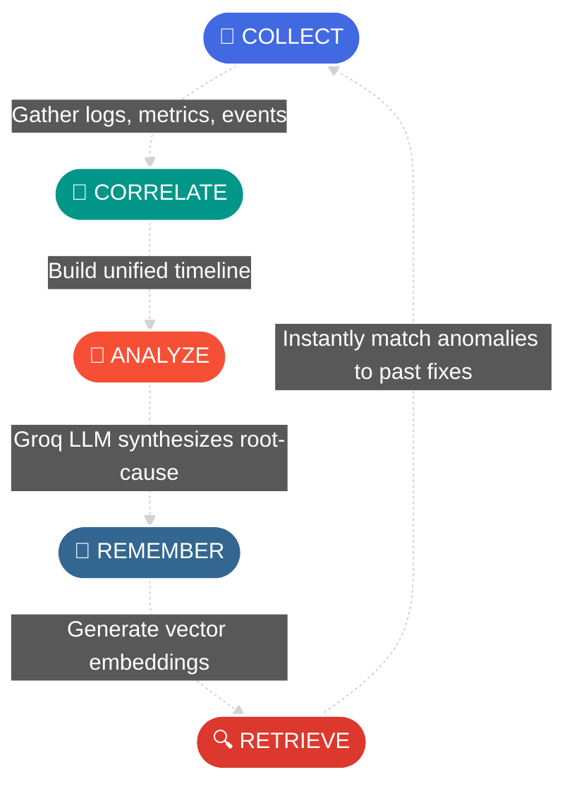
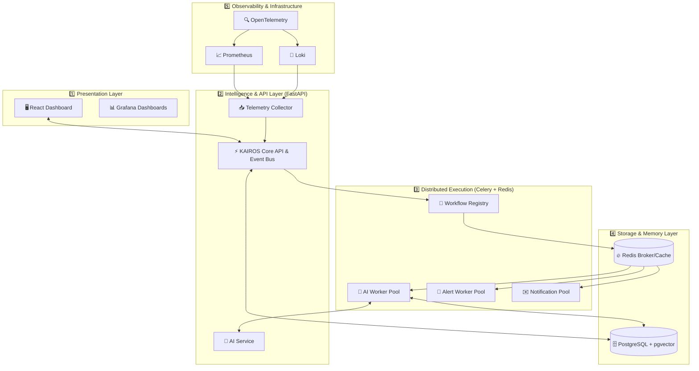

<div align="center">
  

  <h3>🧠 Intelligent Incident Response | 📊 AI-Driven Telemetry | ⚡ Distributed Execution</h3>

  <p align="center">
    <a href="https://github.com/bhargavatejagolla"></a>
    <a href="#"></a>
    <a href="#"></a>
    <br/>
    <a href="https://fastapi.tiangolo.com/"></a>
    <a href="https://www.postgresql.org/"></a>
    <a href="https://redis.io/"></a>
    <a href="https://opentelemetry.io/"></a>
  </p>

  <p align="center">
    <b>Transform Production Incidents into Organizational Knowledge with AI-Powered Telemetry Correlation, Vector Similarity Search, and a Robust Distributed Processing Engine.</b>
  </p>

  <p align="center">
    <a href="#-the-kairos-revolution">Explore Features</a> •
    <a href="#%EF%B8%8F-enterprise-architecture">System Architecture</a> •
    <a href="#-quick-start">Getting Started</a> •
    <a href="#-documentation">Documentation</a>
  </p>
</div>

---

<br/>

## 🌟 What is KAIROS?

In Greek mythology, **Kairos (καιρός)** represents the *opportune moment*—the exact right time for decisive action. 

In modern cloud-native DevOps, when a production deployment fails or an infrastructure incident strikes, every second counts. **KAIROS** acts as an **Enterprise AI Site Reliability Engineer**, automatically aggregating telemetry across isolated tools, correlating logs and metrics, synthesizing root-cause summaries using LLMs, and executing asynchronous remediation workflows. 

Designed and engineered by **Golla Bhargava Teja**, KAIROS ensures **your team never solves the same problem twice.**

> *"When a deployment breaks, engineers shouldn't waste hours manually jumping between Grafana, Prometheus, Loki, Kubernetes CLI, and GitHub. KAIROS unifies your entire observability context into one coherent narrative."*

<br/>

---

## 🚀 The KAIROS Revolution

| ❌ Traditional Incident Response | ✅ The KAIROS Way (Automated & Intelligent) |
| :--- | :--- |
| **Information Silos:** Engineers open 5+ browser tabs (Grafana, Loki, GitHub Actions, K8s dashboard) to piece together clues. | **Unified Evidence Gathering:** Automatically collects metrics, logs, deployment changes, and cluster events into a single timeline. |
| **Context Switching:** Mentally correlating high CPU alerts at 14:02 with a pod restart at 14:03 and a git commit at 14:00. | **Automated Correlation:** Links code deployments directly to application failures and infrastructure degradation. |
| **Tribal Knowledge & Memory Loss:** When the senior SRE who solved an issue leaves the company, the knowledge leaves with them. | **Vector Memory Bank (pgvector):** Embeds incident signatures into PostgreSQL. When a new bug appears, KAIROS instantly recommends past resolutions. |
| **Monolithic Bottlenecks:** Direct API calls blocking threads waiting on 3rd-party services. | **Distributed Background Engine:** Idempotent, robust workflow engine built on Celery, Redis, and event buses ensuring 0% data loss. |
| **Slow MTTR (Mean Time To Resolution):** Average investigation takes 30 to 110 minutes of trial and error. | **AI Root-Cause Analysis:** Groq LLM digests complex stack traces and metrics to provide instant, plain-English summaries and action items. |

<br/>

---

## 🤖 The Enterprise Intelligence Workflow

KAIROS executes complex workflows through a decoupled, **Event-Driven Architecture**:

<div align="center">
  
</div>

<div align="center">



</div>

<br/>

---

## ✨ Core Features Deep-Dive

<details>
<summary><b>🛡️ Security & Enterprise RBAC</b></summary>
<br/>
Enterprise-grade Role-Based Access Control, deep API protections, hierarchical permission mapping across Organizations, Projects, and Environments, secured by OAuth2 and JWT.
</details>

<details>
<summary><b>☸️ Distributed Processing Engine</b></summary>
<br/>
A highly scalable asynchronous Job Framework powered by <strong>Celery</strong> and <strong>Redis</strong>, processing AI evaluations and alerts asynchronously with Dead Letter Queues, Retries, and Distributed Locks.
</details>

<details>
<summary><b>📈 Full Observability Stack</b></summary>
<br/>
Real-time system metrics scraping, alert evaluation, structured logging (JSON), and distributed tracing powered by <strong>Prometheus, Grafana, Loki, and OpenTelemetry</strong>.
</details>

<details>
<summary><b>🤖 AI Root-Cause Engine (Groq / Llama 3)</b></summary>
<br/>
Ultra-fast LLM inference that analyzes stack traces and Prometheus metrics to explain <em>why</em> something broke in plain English, generating instant remediation playbooks.
</details>

<details>
<summary><b>🧠 Vector Memory & Similarity Search</b></summary>
<br/>
Semantic similarity search over historical incidents using high-dimensional embeddings (via <strong>pgvector</strong> and HuggingFace). KAIROS remembers how you fixed it last time.
</details>

<br/>

---

## 🏗️ Enterprise Architecture

KAIROS is engineered as a clean, multi-layered cloud-native platform following **Clean Architecture** principles.

<div align="center">
  
</div>



<br/>

---

## 🛠️ Technology Matrix

| Layer | Technology | Role & Responsibility |
| :--- | :--- | :--- |
| **Backend API** | Python 3.12, FastAPI | High-performance async REST API, telemetry correlation, clean architecture. |
| **Message Broker** | Redis | Rate limiting, distributed locking, Celery brokering, lightning-fast caching. |
| **Background Jobs** | Celery | Async AI inference, scheduled maintenance, Slack/Email dispatch. |
| **Tracing & Metrics** | Prometheus, OpenTelemetry | Auto-instrumented traces across HTTP, Celery, and DB. Custom business metrics. |
| **AI & Intelligence** | Groq API, HuggingFace | Sub-second incident summarization and semantic embedding generation. |
| **Database & Memory**| PostgreSQL, `pgvector` | Relational storage and vector similarity index for historical incident matching. |
| **Data Integrity** | Transactional Outbox | Guarantees zero data loss between PostgreSQL commits and Redis event publishing. |

<br/>

---

## 🚀 Quick Start

Get the entire **KAIROS** platform running on your local machine in minutes.

### 📋 Prerequisites
- [Docker & Docker Compose](https://www.docker.com/)
- Python 3.12+ (For backend development)

### ⚡ 1-Minute Local Setup

```bash
# 1. Clone the repository
git clone https://github.com/bhargavatejagolla/kairos.git
cd kairos

# 2. Configure environment variables
cp .env.example .env
# Edit .env and inject your Groq API Keys to enable AI capabilities.

# 3. Launch backend, database, observability stack, and background workers
docker-compose up -d --build

# 4. Verify deployment status
docker-compose ps
```

### 🌐 Accessing the Services

Once deployed, access the respective portals via your browser:

| Service | Local URL | Description |
| :--- | :--- | :--- |
| **KAIROS Dashboard** | `http://localhost:3000` | Main interactive web interface for incident management |
| **FastAPI Swagger Docs** | `http://localhost:8000/docs` | Interactive OpenAPI documentation and API tester |
| **Grafana Portal** | `http://localhost:3001` | System metrics, custom charts, and Loki log explorer |
| **Prometheus UI** | `http://localhost:9090` | Raw metric targets, PromQL query builder |
| **Flower (Workers)** | `http://localhost:5555` | Celery Background Job Monitoring UI |
| **Jaeger (Tracing)** | `http://localhost:16686` | OpenTelemetry Distributed Trace viewer |

<br/>

---

## 🤝 Authors & Contributors

<div align="center">
  <a href="https://github.com/bhargavatejagolla">
    
  </a>
</div>

<br/>

We welcome contributions from developers, DevOps engineers, and SREs! 
1. Fork the repository
2. Create your feature branch (`git checkout -b feature/amazing-feature`)
3. Commit your changes (`git commit -m 'feat: add amazing feature'`)
4. Push to the branch (`git push origin feature/amazing-feature`)
5. Open a Pull Request

---

## 📄 License

This project is licensed under the **MIT License** — see the [LICENSE](LICENSE) file for details.

---

<div align="center">
  
</div>
