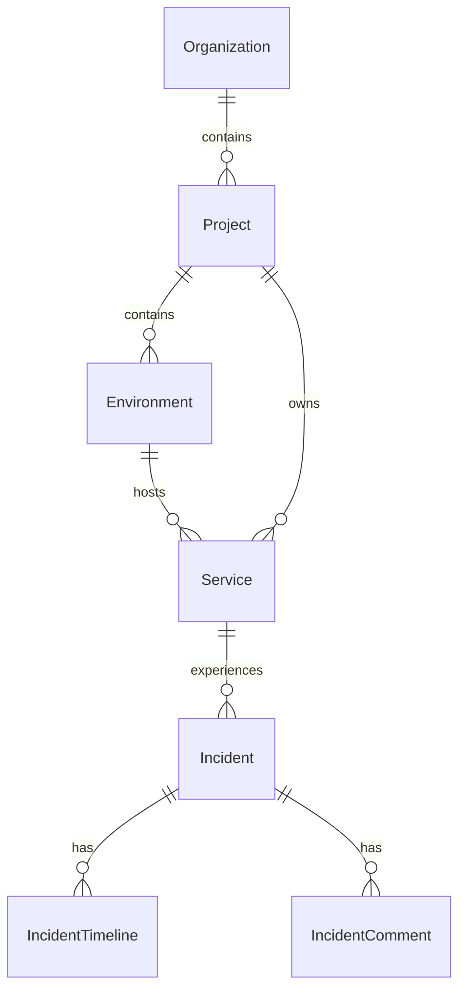

# Incident Management

KAIROS manages incidents through a structured workflow that enforces a state machine. Every incident belongs to a specific Service, which in turn belongs to a Project and Organization.

## ER Diagram



## Lifecycle

All incidents pass through a strict state machine to ensure compliance and proper workflow adherence.

`OPEN` -> `ACKNOWLEDGED` -> `INVESTIGATING` -> `MITIGATED` -> `RESOLVED` -> `CLOSED`

*Note: Incidents can also move directly from `OPEN` to `RESOLVED` or `CLOSED`.*

## APIs

The API is fully RESTful and leverages a Command Bus internally for executing workflows.

### Create Incident
**POST** `/api/v1/organizations/{org_slug}/projects/{project_slug}/services/{service_slug}/incidents`

```json
{
  "title": "High Latency in Payment Processing",
  "description": "Stripe webhook endpoint is experiencing high latency.",
  "severity": "SEV_2",
  "priority": "P2",
  "source": "ALERT"
}
```

**Response**:
```json
{
  "id": "uuid",
  "number": "INC-000001",
  "status": "OPEN",
  "severity": "SEV_2",
  ...
}
```

### Incident Lifecycle Actions
Use specific workflow endpoints to transition state.
- **POST** `/api/v1/incidents/{incident_number}/acknowledge`
- **POST** `/api/v1/incidents/{incident_number}/mitigate`
- **POST** `/api/v1/incidents/{incident_number}/resolve`

*All actions automatically append to the Incident Timeline and emit domain events.*
