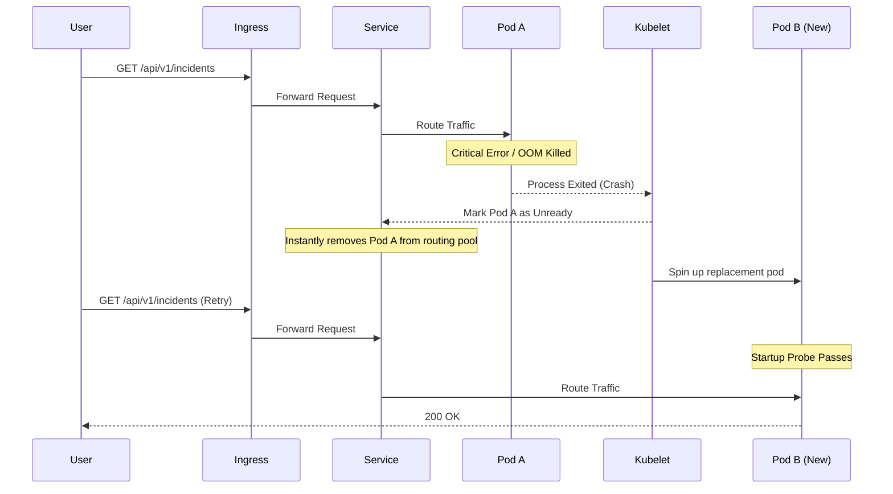
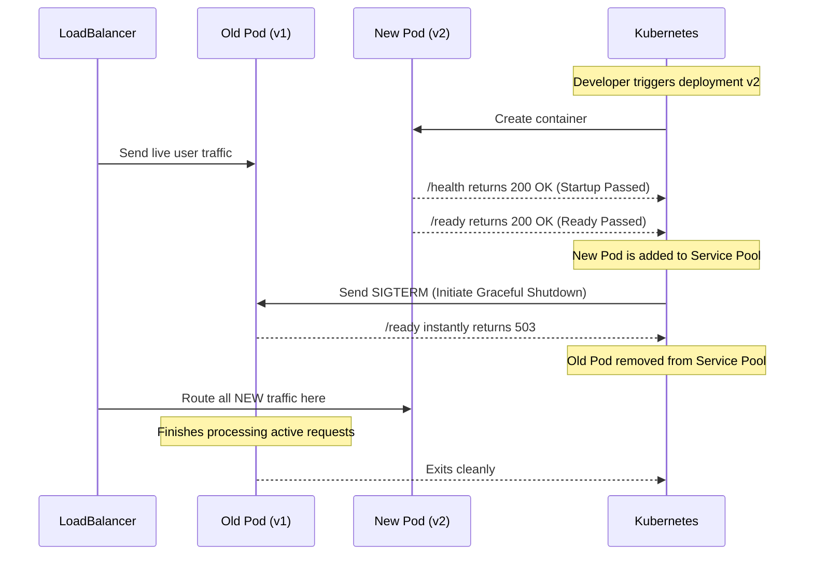

# Kubernetes Failure & Traffic Diagrams

## API Pod Crash Recovery

This diagram demonstrates how Kubernetes handles a catastrophic crash within an API pod seamlessly.

## Zero Downtime Rolling Update

This diagram demonstrates how traffic is handled during a new release rollout without dropping connections.

